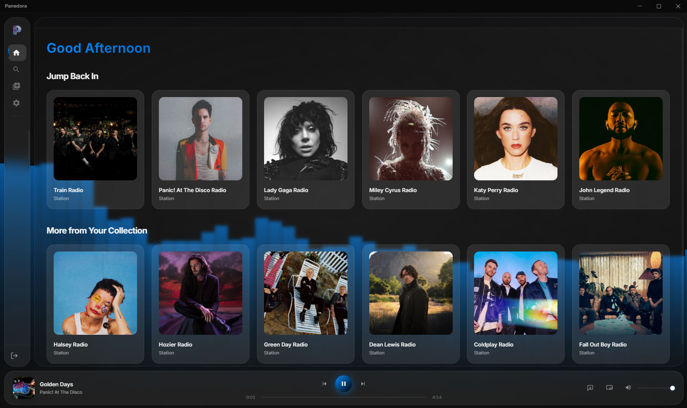

# Panedora

## Project Purpose
Panedora is a personal, educational, and experimental project created purely for fun. It was built as a creative exercise to explore modern UI design (Glassmorphism) and Electron-based desktop application development. This project is intended for personal use only and was developed with zero intent to cause harm, bypass security, or interfere with Pandora's business operations. It is shared as a demonstration of UI/UX design and technical integration.

*A preview of the Panedora immersive station library.*

A premium, immersive Pandora desktop client built with Electron. Panedora features a fully theme-driven Glassmorphism design system, persistent session management, and an enhanced playback experience that goes far beyond the standard Pandora web player.

> [!IMPORTANT]
> **Pandora Plus or Premium subscription required.** This application only works with an active Pandora Plus or Premium account. Free Pandora accounts cannot log in. A paid subscription is required to access the API endpoints that Panedora relies on.

> ### A Note to Developers
> This project is source-available and intended for educational purposes. You are free to explore and learn from the code. However, under the CC BY-NC-ND 4.0 license, you may not distribute modified versions of this software. Additionally, to prevent abuse of the legacy Pandora API and maintain the integrity of subscription-tier checks, please do not modify or tamper with the backend logic (`pandora-api.js`, etc.).

## Recent Updates

*   **Mini Player Transparency & Contrast:** Rewrote the Mini Player window logic to achieve true OS-level transparency. Introduced localized frosted glass "pill" containers and soft radial gradients to ensure readability at any size.
*   **Always-on-Top Mini Player:** Built a compact, floating Mini Player mode that stays on top of other windows (even borderless fullscreen games), providing instant access to playback controls, thumbnail art, and feedback buttons without leaving your current application.
*   **Live Lyrics:** Added a comprehensive lyrics fetching system that seamlessly presents synchronized, time-coded lyrics overlaid on the Now Playing screen, complete with auto-scrolling and a highlighted active line.
*   **Visualizer Overhaul:** Completely reprogrammed the CSS and Canvas audio visualizers (specifically the Reactive Wave and Reactive Circle). Applied heavy math smoothing (25-point rolling averages) and lerp interpolation for fluid, non-jittery motion.
*   **State & Feedback Fixes:** Fixed complex UI bugs where the "Thumb Up" button would randomly clear its state during volume changes, and where the Adaptive Theme color extractor would aggressively re-run on every track update.
*   **Persistent Preferences:** The application now actively saves and restores your preferred Color Theme, Background Effect, and Lyrics Highlight Style across launches.
*   **Startup Stability:** Resolved deep Electron "Access is denied" GPU cache disk errors by configuring specific Chromium command-line switches on boot.
*   **UI Polish:** Hardened CSS layout dimensions for Lyrics Settings previews, rebuilt DOM inheritance to fix width overflowing, tightened highlight box borders, and resolved a global scrolling bug by locking overflow on the body.

## Overview

Panedora is designed to provide the absolute best desktop listening experience for Pandora users. By providing real-time feedback synchronization with your Pandora account, it operates as a fully functional client — not just a web wrapper. Every visual element is driven by a live CSS custom property system, so the entire look of the app updates instantly whenever you switch themes or effects.

## Key Features

### Immersive Glassmorphism Design
*   **Theme-Driven Aesthetic:** The entire app background, accent colors, glows, and gradients are controlled by CSS custom properties that update at runtime. The look of the app is completely determined by whichever theme you have selected — there is no single fixed color scheme.
*   **9 Built-In Themes:** Choose from Midnight Violet, Deep Ocean, Emerald Forest, Sunset Blaze, Rose Quartz, Arctic Frost, Neon Cyber, Classic Dark, and Adaptive (Dynamic). Each theme instantly transforms every color, gradient, and glow in the UI.
*   **Adaptive (Dynamic) Theme:** When selected, the app samples the current track's album artwork using an HTML5 Canvas pixel-extraction algorithm and automatically derives a dominant accent color, updating the entire UI palette in real time as songs change.
*   **Frosted Glass Panels:** The side navigation and footer player bar render as floating, translucent islands using `backdrop-filter: blur()` on a fully transparent Electron window.
*   **Detached Navigation & Player:** The sidebar and footer player render as separate floating panels with gap spacing between them, giving the interface a premium, native-app feel.
*   **Collapsible Sidebar:** The sidebar collapses into a sleek icon-only view (62px wide) and expands smoothly on hover (250px) to reveal labels, station names, and the sign-out button — maximizing content space at all times.
*   **Immersive Now Playing:** A full-bleed dedicated page for focused listening, featuring large album artwork, high-res track metadata, feedback controls, and your recently played history.
*   **Custom Frameless Window:** The application runs as a fully frameless, transparent Electron window with a custom drag-region title bar and standard minimize/maximize/close controls.

### Background Effects
The Settings page lets you choose from 10 animated background effects, all of which inherit the active theme's accent color:
*   **Waves**
*   **Orbs**
*   **Space**
*   **Grid**
*   **Particles**
*   **Rings**
*   **Reactive (Bars)**
*   **Reactive (Circle)**
*   **Reactive (Wave)**
*   **Static**

Your selected effect is saved and restored automatically on next launch.

### Enhanced Player Experience
*   **High-Quality Audio:** The client requests the `aacplus` (HE-AAC) streaming format, ensuring a clear and consistent listening experience.
*   **Seamless Playback Controls:** Standard controls (Play, Pause, Skip, Previous) integrated cleanly into a floating player footer. The previous button intelligently restarts the current track if you are more than a few seconds in, mirroring natural playback behavior.
*   **Mini Player Mode:** Collapse the app into a compact 540×100 bar that floats above all other windows using the `screen-saver` always-on-top level — including borderless fullscreen games. The mini player includes playback controls and quick-access feedback buttons.
*   **Lyrics Button:** A dedicated lyrics toggle in the player footer fetches and displays time-coded, auto-scrolling lyrics overlaid on the Now Playing page.
*   **Lyrics Highlight Styles:** Choose how the active lyric line is highlighted — Text Glow (scaled, glowing text), Pill Box (a tightly padded container border), or Full Line (a full-width background block).

### Intelligent Feedback & History System
*   **Reactive Feedback:** Large, interactive Like (Thumbs Up) and Dislike (Thumbs Down) buttons on the Now Playing page feature dynamic visual states and synchronize directly with the Pandora API.
*   **Smart Toggling:** Clicking an already-active feedback button calls the Pandora API to delete the feedback preference, rather than just toggling a local UI state.
*   **Persistent Song History:** A dedicated "Recently Played" panel on the Now Playing page tracks and displays the last 20 songs you have listened to, complete with album art and your feedback status for each track.
*   **Undo Dislike:** If you dislike a song (which automatically skips it), you can find it in your history panel and click the "Undo" button to instantly remove the negative feedback via the Pandora API, returning the track to your rotation.
*   **Live Synchronization:** The history list updates in real time as songs change or feedback is toggled, with no manual page refresh required.

### Station Library
*   **Home Screen:** Displays a time-aware greeting ("Good Morning", "Good Afternoon", "Good Evening") and organizes your stations into two grids: "Jump Back In" (your 6 most recently played) and "More from Your Collection" (the next 6 by recency).
*   **Full Library View:** The Library page shows all your stations sorted alphabetically with a live filter input — type to narrow down results instantly as you type, with a debounced update and preserved cursor position.
*   **Search:** Search for songs, artists, and stations. Results are organized into separate sections. Note that playing a specific song from search results is a work in progress.

### Robust Session Management
*   **Secure Authentication:** Signs in directly with Pandora's official REST API, generating and managing the required auth tokens and CSRF tokens for all subsequent requests.
*   **Clean Sign Out:** A dedicated sign-out process permanently wipes session tokens, pauses active streams, and safely tears down the player state to prevent ghost playback or infinite reload loops.

## Technical Architecture

Panedora is built using a modern Electron stack, emphasizing security and separation of concerns:

*   **Main Process (`main.js`):** Acts as the orchestrator. It manages the application lifecycle, handles all API requests to Pandora from the secure Node.js context, builds playlist queues, manages the `songHistory` array, controls the Mini Player window state, and exposes functionality to the renderer via IPC handlers.
*   **Pandora API Controller (`pandora-api.js`):** A dedicated class that handles all communication with Pandora's backend REST endpoints. It routes requests through Electron's `net.fetch` (Chromium's native network stack) and manages auth token and CSRF token lifecycle.
*   **Renderer Process (`renderer.js`):** The frontend layer. Built with vanilla JavaScript, HTML5, and CSS3. Handles all DOM rendering, routing between pages (Home, Search, Library, Now Playing, Settings), audio playback via the HTML5 `<audio>` element, the full theme and background effect system, lyrics fetching and rendering, and the Adaptive theme color extraction algorithm.
*   **Audio Visualizer (`visualizer.js`):** A standalone class powered by the Web Audio API. Initializes an `AudioContext`, taps into the HTML5 audio element via a `MediaElementSource`, and drives three Canvas-based reactive visualizer styles (Bars, Circle, Wave) with configurable FFT sizes and smoothing.
*   **Preload Script (`preload-ui.js`):** Establishes a secure IPC bridge using Electron's `contextBridge`. Context isolation is enabled, meaning the renderer has zero direct access to Node.js or Electron APIs — all privileged calls go through the explicitly exposed `window.api` surface.
*   **Styling (`styles.css`):** Built entirely on CSS custom properties (variables) for the theme system. Employs CSS Grid, Flexbox, `backdrop-filter`, CSS animations, and a transparent/frameless window setup to achieve the Glassmorphism aesthetic.

## Automated Builds & Releases
This project utilizes a GitHub Actions Continuous Integration (CI/CD) pipeline. Whenever a new version tag is published, the workflow automatically provisions Windows, macOS, and Linux runners to build the application and attaches the ready-to-use `.exe`, `.dmg`, and `.AppImage` installers to the [Releases](https://github.com/MitchellBrovarnik/Panedora/releases) page.

You do **not** need to compile the application locally. Simply navigate to the Releases tab to download the platform-specific installer for your system.

## Usage

1. **Sign In:** Launch the application and sign in using your Pandora credentials. A Pandora Plus or Premium subscription is required — free accounts are not supported. An active internet connection is required.
2. **Library Navigation:** Your stations populate the Home screen in two grids. Click any station card to begin playback. Use the Library page to browse and filter your full collection alphabetically.
3. **Now Playing:** Click the album artwork in the footer player bar to open the full Now Playing view, which includes large artwork, track metadata, feedback buttons, and your Recently Played history.
4. **Curating & History:**
   *   Use the **Thumbs Up** / **Thumbs Down** buttons to inform Pandora's algorithm of your preferences.
   *   Review your recently played tracks in the panel on the right side of the Now Playing page. Click **Undo** on any disliked track to remove the negative feedback from your Pandora account.
5. **Lyrics:** Click the **Lyrics** button in the player footer to display synchronized, scrolling lyrics over the Now Playing page.
6. **Mini Player:** Click the **Mini Player** button to collapse the app into a compact floating bar that stays on top of all other windows, including fullscreen games.
7. **Themes, Effects & Settings:** Click the **Settings** gear in the sidebar to choose a Color Theme, Background Effect, and Lyrics Highlight Style.
8. **Sign Out:** Hover over the left sidebar to expand it, then click the **Sign Out** button at the bottom to safely end your session.

## Known Issues

*   **Station Tuning Limitations:** The "Tune Your Station" feature (e.g., selecting "Discovery", "Deep Cuts", or "Artist Only") is currently not supported directly within Panedora.
    *   **Workaround:** Open the official Pandora web or mobile app, go to your station, select the desired Tune mode, and let a few songs play. When you return to Panedora, that station will reflect the updated tuning.
*   **Search Functionality:** The search tab is a work in progress. Searching for a specific song may not play that exact track.

## Privacy and Security

Panedora is designed with user privacy as a priority:
*   **Direct Authentication:** Your credentials are used solely to authenticate with Pandora's official API. Your password is encrypted at rest using your operating system's secure keychain (Electron safeStorage).
*   **Local Storage Only:** Authentication tokens and encrypted credentials are stored locally on your machine in your user data directory. All auth data is cleared on sign-out.
*   **No Third-Party Tracking:** No personal data is collected or shared with any third-party services. The application communicates exclusively with Pandora's infrastructure.

## License

This project is licensed under the CC BY-NC-ND 4.0 License. See the LICENSE file for details.

## Disclaimer

This application is an unofficial, third-party client created for personal, non-commercial use and educational purposes. It is not affiliated with, endorsed by, or sponsored by Pandora Media, LLC, or its parent company, Sirius XM Holdings Inc. 'Pandora' is a registered trademark of Pandora Media, LLC. No proprietary Pandora assets or code are included in this repository.

> [!TIP]
> **DISCLAIMER:** This application only works with an active Pandora Plus or Premium subscription. Using a paid account ensures full compatibility with all playback features and provides the highest audio quality available through the API.
